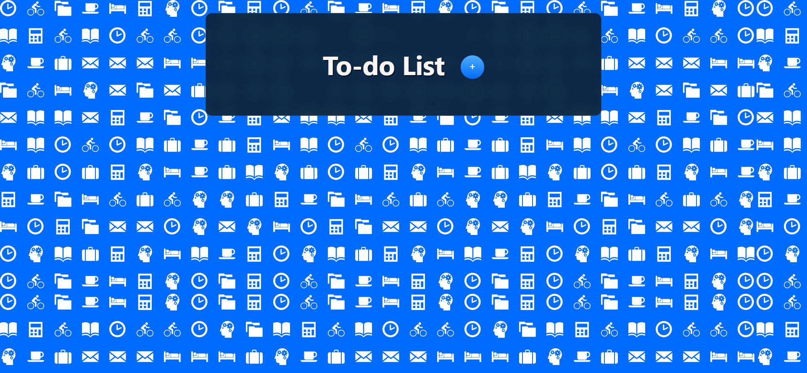
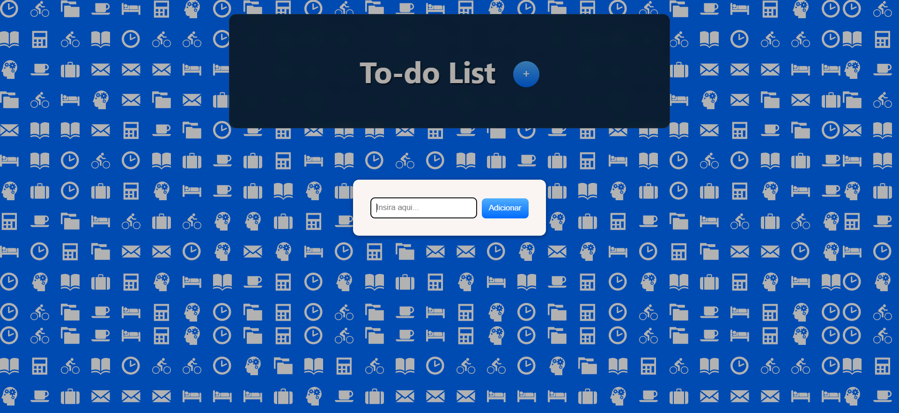
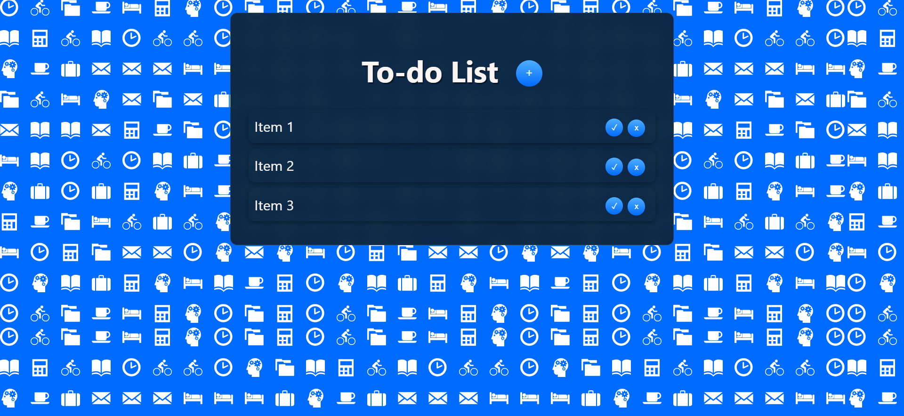
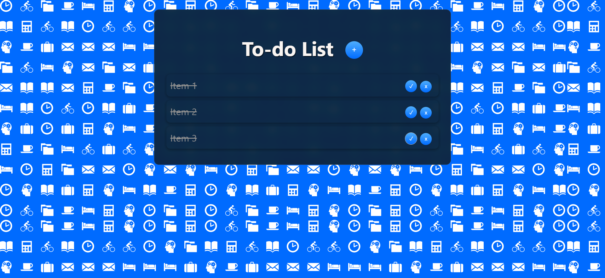

# To-do List :pencil2:

## Sobre

A to-do list é um projeto simples, porém muitas vezes subestimado, uma vez que através dela podemos praticar criando diversas funcionalidades próprias, criando uma UI personalizada, seja com componentes próprios ou de uma lib do seu gosto, além da integração com outras tecnologias. 

A aplicação foi construída com React + Redux e faz uso de um modal para adicionar seus itens, é possível assinalar itens para riscá-los da lista e também deletá-los, além da persistência de dados no localStorage.

## Inicializando

Clone o repositório e com o comando `npm start` o React abrirá a To-do List no endereço http://localhost:3000 do seu navegador.

